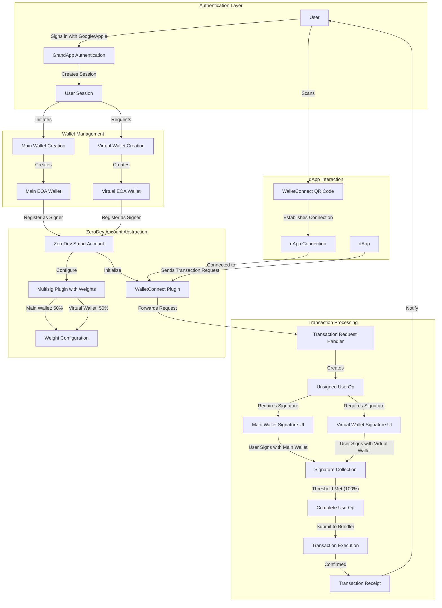

# Grand App

## Introduction

Grand is the one-stop investment app for on-chain finance, eliminates middlemen and provides self-custodial, biometric-secured, 1-click access to verified blue-chip DeFi and RWA protocols, without leaving the app. Grand is simple and intuitive for Newcomers, yet powerful enough for Degens.

**Why Grand?**

Despite DeFi's potential, security risks, complexity, and fragmented access keep many users away. Grand solves this by providing:

✅ **Verified Blue-Chip DeFi** **& RWA**– Access only the most secure and audited protocols without leaving the app.

✅ **1-Click DeFi Strategies** – RWA, perps, staking, re-staking, index funds, lending & more.

✅ **Built-in Security** – Seedless access, passkey login, Face ID, social recovery & smart accounts.

✅ **Virtual Wallets for more dApp Access** – Securely connect to any dApp via WalletConnect using your dedicated virtual wallet, keeping your main wallet safe.

✅ **Seamless Spending** – Spend crypto like cash via **real-world payment infrastructure**.

------

## Tech Stack

### Frontend (Mobile App UI & Logic)
- React Native: Framework for building native mobile apps using JavaScript/TypeScript. Lets you write one codebase for both iOS and Android.
- TypeScript: A superset of JavaScript that adds static typing. Helps prevent bugs and makes your codebase more robust and scalable.
- UI Kitten: An open source UI kit optimized for React Native with design system support, style props, and performance optimizations. Great for building beautiful, consistent interfaces across platforms.
- Metro Bundler: React Native’s JavaScript bundler. It handles building and serving your app's JS bundle. You’ll mostly interact with this when debugging or configuring custom setups.

### Blockchain
- Solidity: The primary language for writing smart contracts on Ethereum and compatible blockchains (Polygon, Arbitrum, etc). You'll use it to build on-chain logic — DeFi features, tokens, identity, etc.
- [ZeroDev](https://docs.zerodev.app/): An Account Abstraction (ERC-4337) SDK/platform. It allows you to build smart contract wallets (instead of EOA wallets) — ideal for enabling gasless transactions, programmable wallet logic, social recovery, etc. Fits perfectly if Grand App avoids seed phrases and is security-first.

### Backend & Infra
Supabase: A Backend-as-a-Service (BaaS) platform.
- Auth (Google/Apple sign-in, anonymous sessions, etc.)
- Database (supports PostgreSQL)
- Edge Functions (serverless backend logic)
- Realtime updates

------

## Virtual Wallets

### Virtual Wallets Implementation

For virtual wallets concept, we could:

1. **Create multiple smart accounts**: Each with its own WalletConnect plugin and multisig configuration
2. **Isolate risk**: Each virtual wallet can have different signers or thresholds
3. **Manage permissions**: Set spending limits or allowed dApps per virtual wallet
4. **Centralized approval UI**: Build a single interface where users approve transactions from all virtual wallets


### Key Benefits

1. **Enhanced Security**: dApp transactions must go through your multisig approval process
2. **Seamless dApp Integration**: Works with any dApp that supports WalletConnect
3. **Flexible Authentication**: Can combine EOAs with other authentication methods
4. **Account Abstraction Features**: Gas sponsorship, batched transactions, etc.


This architecture gives us the best of both worlds - the wide compatibility of WalletConnect with the security of multisig and the advanced features of account abstraction.

ZeroDev's WalletConnect plugin allows your smart account to connect to any dApp that supports WalletConnect, while maintaining the security of multisig setup as below,



### Key Technical Considerations

1. **Weighted Signatures**: ZeroDev supports weighted signatures through its multisig implementation. You can assign different weights to different signers and set a threshold that must be met.
2. **EOA Creation**: Both your main and virtual wallets can be standard EOAs created from private keys. These EOAs serve as signers for your ZeroDev smart account.
3. **Social Authentication**: You can use social authentication (Google/Apple) to authenticate users to your app, then create or retrieve their EOA wallets.
4. **WalletConnect Integration**: ZeroDev's WalletConnect plugin allows your smart account to connect to any dApp that supports WalletConnect.
5. **Transaction Flow**: When a dApp sends a transaction request, it goes through your smart account, which requires signatures from both EOAs based on your weighted configuration.

This architecture gives us a secure, flexible system for managing virtual wallets with weighted multisig approval, all while maintaining compatibility with the broader dApp ecosystem through WalletConnect.

### Pseudo Codes for Virtual Wallet Flow

#### 1. Social Authentication & EOA Creation

```typescript
// 1. Authenticate with Google/Apple
const userCredential = await signInWithGoogle(); // or signInWithApple()
const userId = userCredential.user.uid;

// 2. Create Main EOA (could be derived from a seed phrase)
const mainWalletPrivateKey = generatePrivateKey(); // or retrieve from secure storage
const mainWalletOwner = await createECDSAOwner({
  privateKey: mainWalletPrivateKey
});

// 3. Create Virtual EOA
const virtualWalletPrivateKey = generatePrivateKey();
const virtualWalletOwner = await createECDSAOwner({
  privateKey: virtualWalletPrivateKey
});
```

#### 2. Setting Up Weighted Multisig

```typescript
// Create a weighted multi-owner plugin
// ZeroDev supports weights through the threshold mechanism
const multiOwnerPlugin = await createMultiOwnerPlugin({
  owners: [
    {
      address: await mainWalletOwner.getAddress(),
      weight: 50 // 50% weight
    },
    {
      address: await virtualWalletOwner.getAddress(),
      weight: 50 // 50% weight
    }
  ],
  threshold: 100 // 100% required (both signatures needed)
});

// Create the smart account with the multi-owner plugin
const smartAccount = await createZeroDevAccount({
  projectId: "YOUR_ZERODEV_PROJECT_ID",
  plugins: {
    multiOwner: multiOwnerPlugin
  }
});
```

#### 3. WalletConnect Integration

```typescript
// Add WalletConnect plugin to the smart account
const walletConnectPlugin = await createWalletConnectPlugin({
  projectId: "YOUR_WALLETCONNECT_PROJECT_ID",
  metadata: {
    name: "GrandApp Virtual Wallet",
    description: "Secure virtual wallet with weighted multisig",
    url: "https://grandapp.com",
    icons: ["https://grandapp.com/icon.png"]
  }
});

// Add the plugin to the smart account
smartAccount.plugins.walletConnect = walletConnectPlugin;

// Generate QR code for dApp connection
const uri = await smartAccount.plugins.walletConnect.getUri();
// Display QR code to user using any QR code library
displayQRCode(uri);
```

#### #### 4. Transaction Signing & Execution

```typescript
// Listen for transaction requests from dApps
smartAccount.plugins.walletConnect.on("session_request", async (event) => {
  const { topic, params } = event;
  const { request } = params;
  
  // Create unsigned UserOp
  const userOp = await smartAccount.createUnsignedUserOp({
    target: request.params[0].to,
    data: request.params[0].data,
    value: BigInt(request.params[0].value || "0")
  });
  
  // Get signature from main wallet
  const mainWalletSignature = await mainWalletOwner.signUserOp(userOp);
  
  // Get signature from virtual wallet
  const virtualWalletSignature = await virtualWalletOwner.signUserOp(userOp);
  
  // Combine signatures according to the multisig plugin requirements
  const signedUserOp = await smartAccount.signUserOp(userOp, {
    signatures: [mainWalletSignature, virtualWalletSignature]
  });
  
  // Execute the transaction
  const txHash = await smartAccount.sendUserOp({ userOp: signedUserOp });
  
  // Respond to the dApp
  await smartAccount.plugins.walletConnect.respond({
    topic,
    response: {
      id: params.request.id,
      jsonrpc: "2.0",
      result: txHash
    }
  });
});
```

## Repositories

- [Mobile App](https://github.com/its-grand-app/grand-app)

P.S. all of repositories and tech docs private for now. Please contact me at [ugur@itsgrand.app](mailto:ugur@itsgrand.app) to access them.